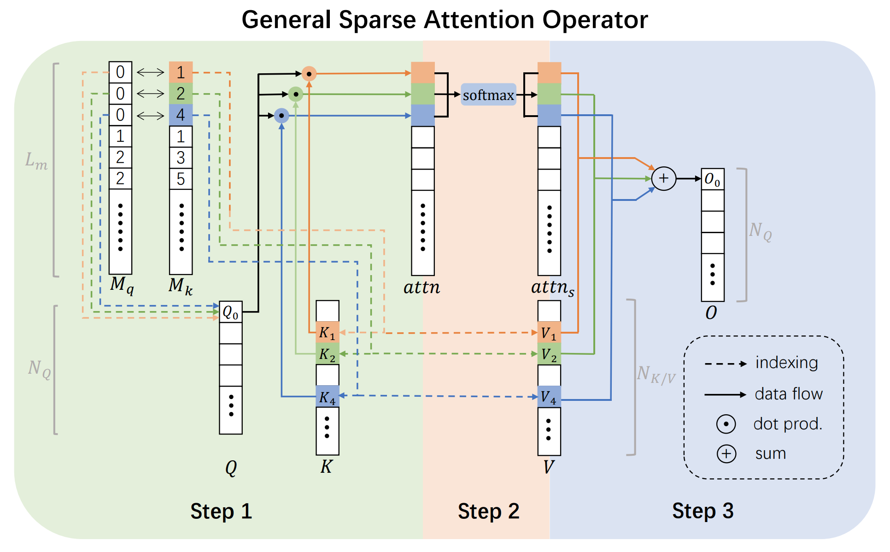

# Scatter Attention/Matcher

**More code is being arranged and will be released soon**.

This the highly optimized general sparse attention/matching operator used by [**ASTR**](https://astr2023.github.io/) (accepted by CVPR2023) and [**SEM**] (coming soon).

More technical details can be found in [ASTR_Supp.pdf](https://astr2023.github.io/files/ASTR_Supp.pdf).

## Acknowledgement

Our code is inspired by [Stratified Transformer](https://github.com/dvlab-research/Stratified-Transformer). We also refer to its implementation, and implement our code using [numba](https://numba.pydata.org/).

## License

MIT

